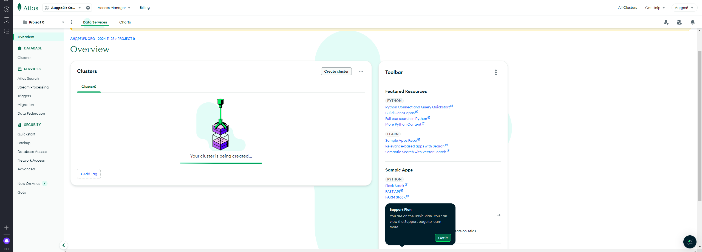
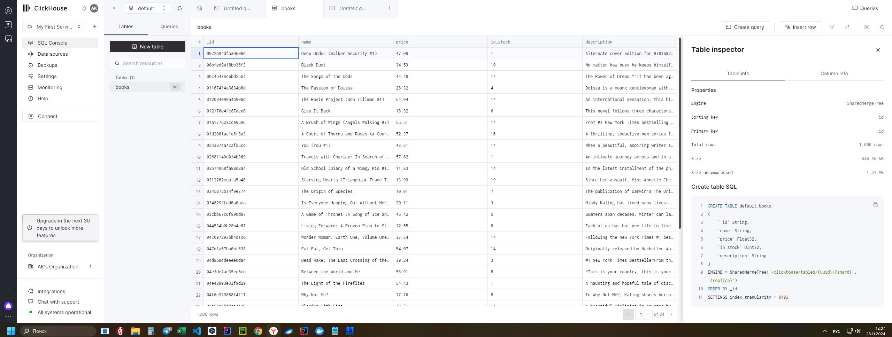

## Урок 2. Парсинг HTML. BeautifulSoup

[BeautifulSoup.py](BeautifulSoup.py) код второго урока

[books_upc.json](books_upc.json) результат работы

---

## Урок 3. Системы управления базами данных MongoDB и Кликхаус в Python

Установите MongoDB на локальной машине, а также зарегистрируйтесь в онлайн-сервисе. https://www.mongodb.com/ https://www.mongodb.com/products/compass

Регистрация в онлайнсервисе
 

Загрузите данные, которые вы получили на предыдущем уроке путем скрейпинга сайта с помощью Buautiful Soup в MongoDB и создайте базу данных и коллекции для их хранения.
Поэкспериментируйте с различными методами запросов.

[mongodb.py](mongodb.py) код по работе с MongoDB (развернута с помощью Docker)

Зарегистрируйтесь в ClickHouse.
Загрузите данные в ClickHouse и создайте таблицу для их хранения.

[clickhouse.py](clickhouse.py) код для вставки данных в таблицу ClickHouse

 результат работы скрипта